# AFS Task - Items Manager

A Flutter CRUD application implementing Clean Architecture, Bloc state management, and SQLite for local persistence. This project focused on a modular structure with a clean, responsive UI.

## Features

- **Clean Architecture Implementation**: Divided into Data, Domain, and Presentation layers for better separation of concerns.
- **Bloc State Management**: Predictable state handling and clear logic isolation.
- **Dependency Injection**: Integrated `GetIt` as a service locator to manage singletons and factory instances.
- **Local Database**: Used `sqflite` for persistence with built-in migration support for schema updates.
- **UI and Design**:
  - Implemented Material 3 design principles throughout the app.
  - Custom typography using `Google Fonts` (Outfit for headers and Inter for body text).
  - Custom animations for list transitions and form bottom sheets.
  - Shimmer-based skeleton loading for a better user experience.
- **Functionality**:
  - Standard CRUD operations (Create, Read, Update, Delete).
  - **Multi-selection & Bulk Actions**: Users can select all items or specific items for bulk deletion.
  - Advanced filtering based on item edit status and chronological sorting.
- **Error Handling**:
  - Centralized input validation.
  - Real-time network connectivity monitoring with visual feedback.
  - Snackbar notifications for asynchronous operations and error reporting.

## Tech Stack

- **Flutter SDK**
- **flutter_bloc** (State Management)
- **get_it** (Dependency Injection)
- **sqflite** (Database)
- **google_fonts** (Typography)
- **connectivity_plus** (Network Monitoring)

## Project Structure

```text
lib/
├── core/
│   ├── di/               # Service Locator setup
│   ├── network/          # Connectivity logic
│   ├── theme/            # Centralized styles and colors
│   └── utils/            # Shared validators and utilities
├── features/
│   └── item/
│       ├── data/         # Models and repository implementation
│       ├── domain/       # Use cases and repo interfaces
│       └── presentation/ # BLoCs, views, and feature-specific widgets
└── main.dart             # App initialization
```

## Setup and Installation

### 1. Requirements
Ensure the Flutter SDK is installed and configured on your system.

```bash
flutter --version
```

### 2. Clone the Repository
```bash
git clone https://github.com/Marwanali2/AFS-task.git
cd AFS-task
```

### 3. Install Packages
```bash
flutter pub get
```

### 4. Run the Project
```bash
flutter run
```

## Architecture and Technical Decisions

- **Modular Views**: Large page files like `ItemsPage` were broken down into smaller components (e.g., `ItemsView`, `ItemsSelectionAppBar`) to improve readability and maintenance.
- **Minimalistic Data Flow**: For this local task, I chose to simplify some patterns by removing unnecessary boilerplate like `Failure` object hierarchies, preferring more direct error handling suitable for SQLite operations.
- **Service Locator Initialization**: All dependencies are initialized asynchronously in `main.dart` before the app starts to ensure everything is ready for injection.
- **Persistence Handling**: Database versions and upgrade paths are manually managed to ensure existing data is preserved during manual schema changes.

## Assumptions
- The app is primary intended for local use, so remote synchronization logic is abstracted out.
- Material 3 is supported by the target device/emulator.
- Validation rules (like the 3-character minimum for names) are sufficient for basic data integrity.

---
Developed for the AFS Task.

## Screenshots

### Items Flow
<p align="center">
  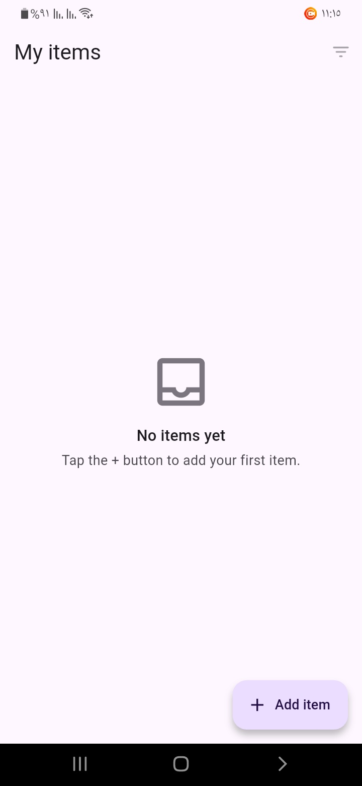
  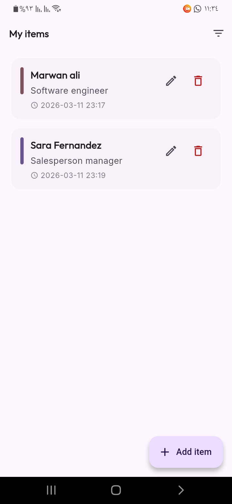
</p>

### Add Item Flow
<p align="center">
  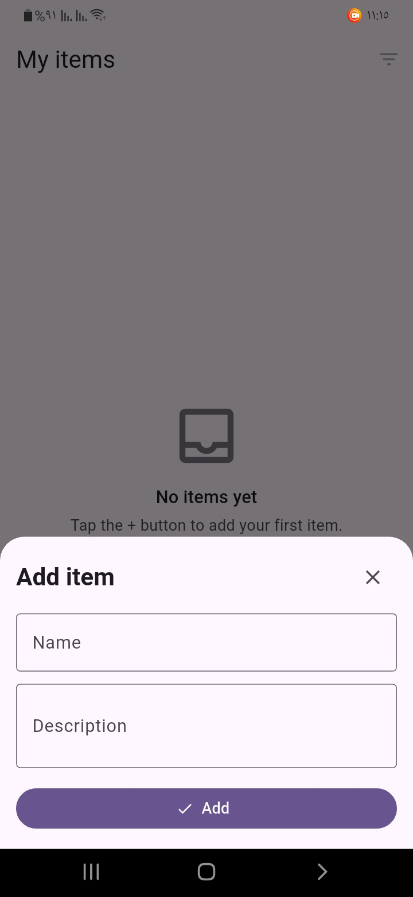
  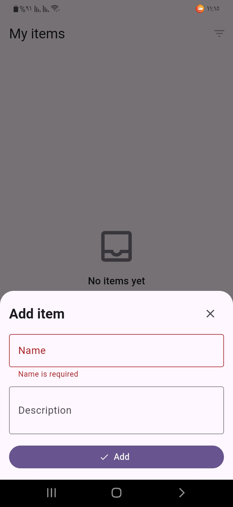
</p>

### Edit Item Flow
<p align="center">
  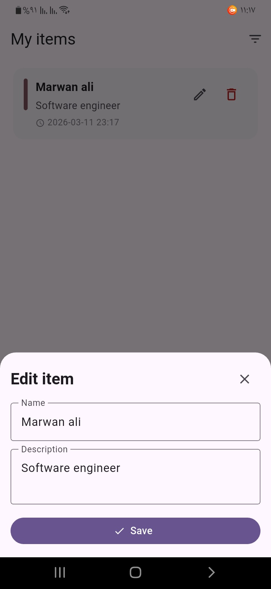
  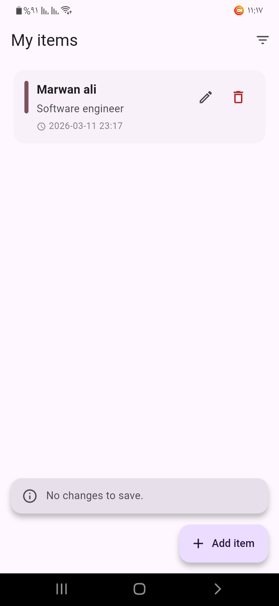
</p>

### Success Notifications
<p align="center">
  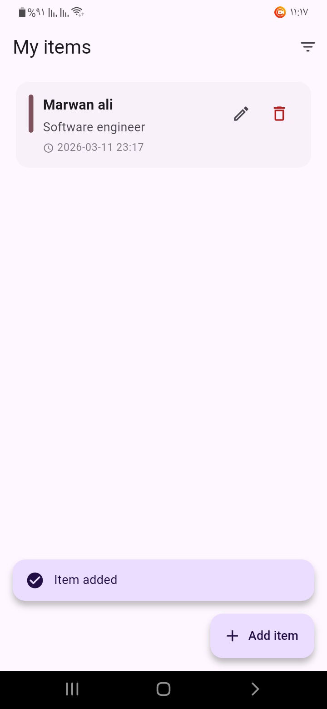
  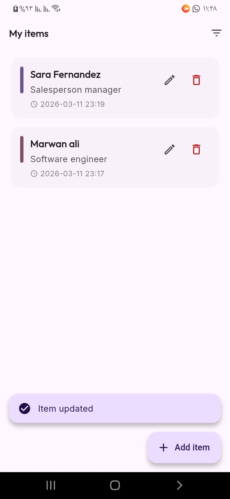
</p>

### Filtering & Sorting
<p align="center">
  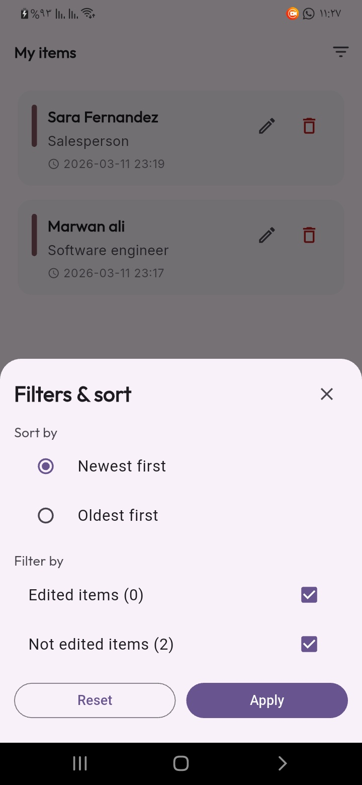
  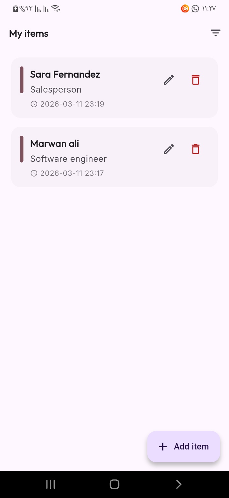
</p>

### Actions & Results
<p align="center">
  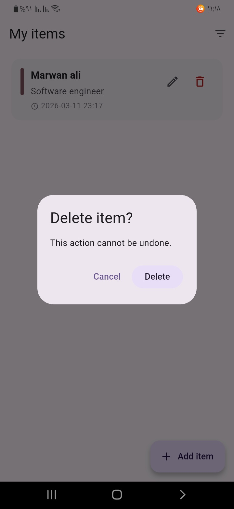
  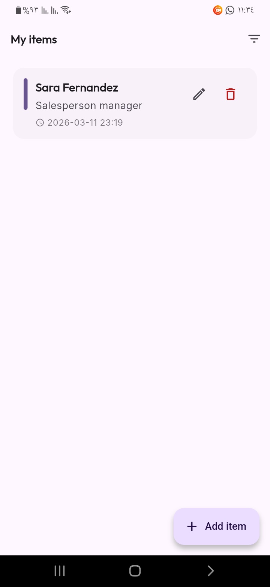
</p>

### Bulk Actions Flow
<p align="center">
  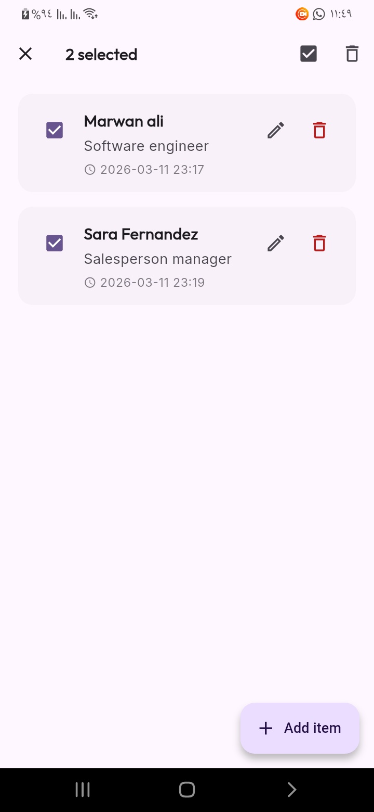
  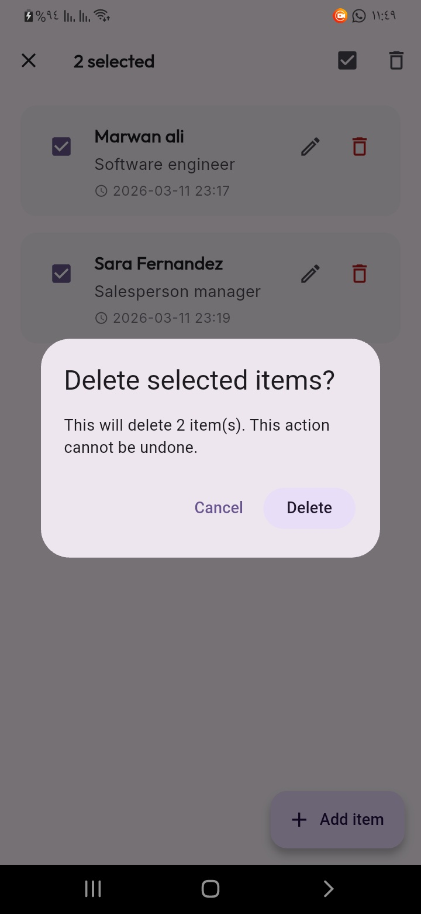
  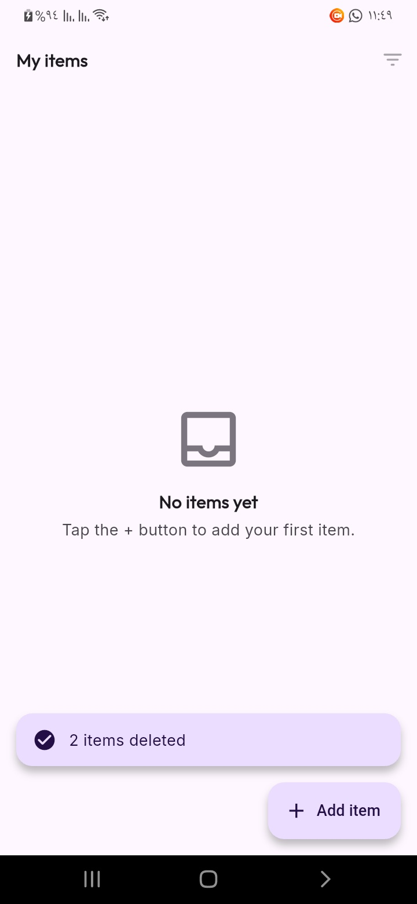
</p>
